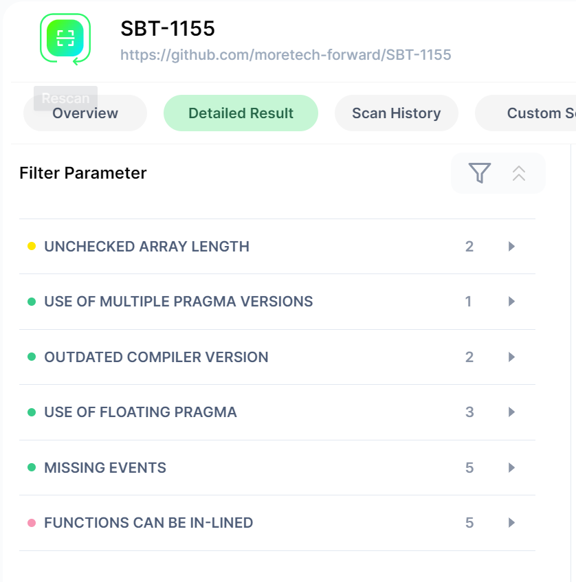

# Audit

## Findings

### [solidityscan.com](solidityscan.com)




### Analysis

#### MEDIUM

The array is checked for equality of lengths, and it is assumed that a person will not contribute too many addresses per race for mint tokens

There will be a warning about it at the front

#### LOW

You can ignore it, since all errors are compiler version related, and the internal functions are taken from the tested OpenZeppelin library

#### GAS

Vulnerabilities were tested and accepted as false positives

### Slither

```sh
slither .
```

#### [Contracts that lock Ether](https://github.com/crytic/slither/wiki/Detector-Documentation#contracts-that-lock-ether)

It appeared because SolidityScan was complaining about gas optimizations and asked to make `payable` functions (such a function does not check that `msg.value == 0` and therefore costs cheaper)

The implication is that users will not send `msg.value` to the contract, hence ether will not be blocked.
